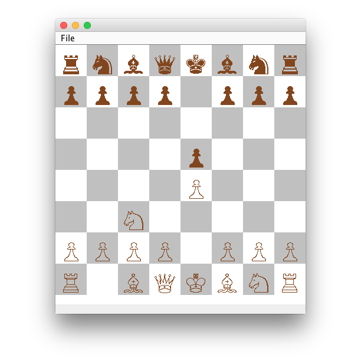

# Chess
A chess program, that allows for the writing of custom AI.

## Get Started
1. Setup the source code in a IDE of  your choice.
2. Create a new subclass of *ComputerPlayer*. To get started take a look at *RandomMove* or *UnimplementedPlayer*
4. (Optional) If you want unit tests to work you will have to at JUnit 4 to your build path

## Copying
See LICENSE
